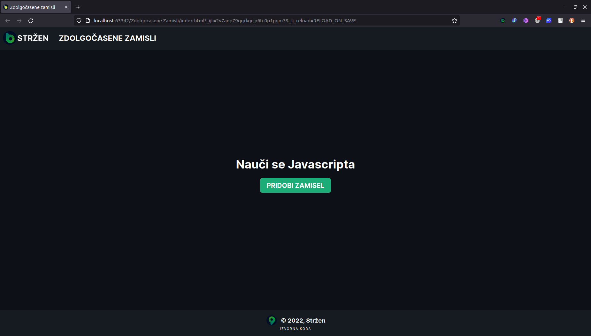
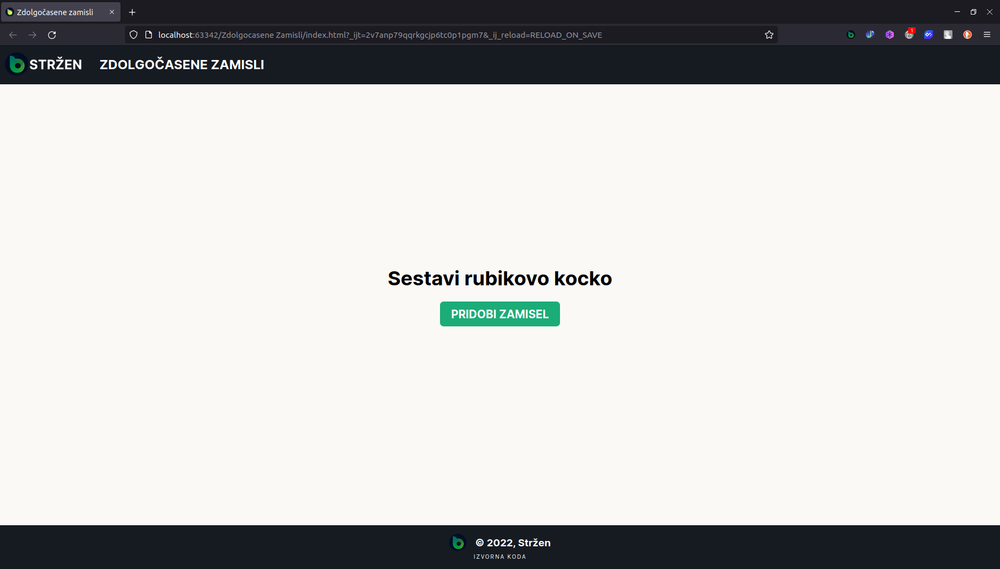
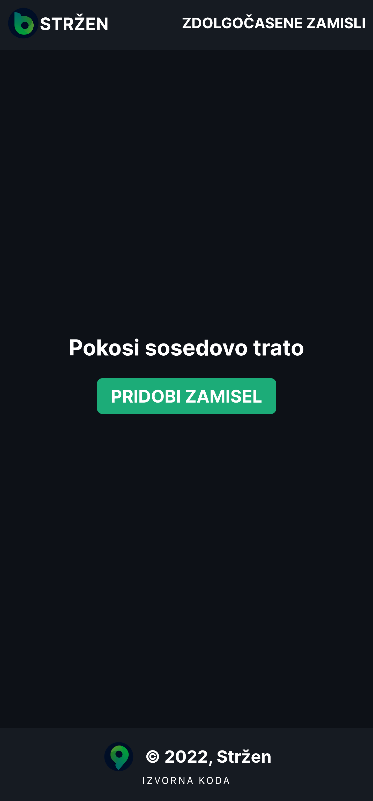

# Zdolgočasene-zamisli
Preprosta stran z zamislimi iz API-ja, 2 različnima barvnima načinoma ter prilagojena napravam vseh zaslonov.
Vsebina zamisli iz API-ja je angleška, zato je sproti prevedena, kar lahko povzroči nejasne ali slabo razumljive zamisli.
Izdelana za vajo HTML/CSS/JAVASCRIPT => API. 
//S PRITISKOM NA MAJHNO SLIKO STRŽENA NA DNU STRANI SPREMENITE BARVNI NAČIN STRANI.
 
<a href="https://zamisli.strzen.xyz">Predogled</a> v živo.
 
Slike:
 
Predogled -računalnik (Temni način)
 

Predogled -računalnik (Svetli način)
 

Predogled -mobitel (Temni način)
 

